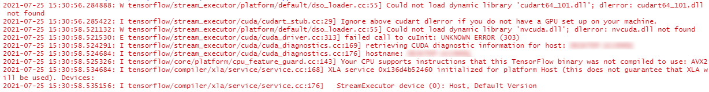

```{r Setup Chunk, message=FALSE, warning=FALSE, include=FALSE, paged.print=FALSE}
Sys.setenv(RETICULATE_PYTHON = "")
library(keras)
```


# Introduction

The imageseg package provides function that allow users to extract information from vegetation photos using image segmentation and sophisticated deep learning models, but it tries its best to make it as simple to use as possible. Thus, most of the complexity is happening behind the curtains, and users only need to provide input data (images) and download pre-trained models. 

We provide two pre-trained models for forest structural metrics They allow the assessment of:

1) canopy closure and canopy cover from canopy photographs
2) understory vegetation density from photographs of a red flysheet at a distance from the observer (training data used 10m distance).

In this vignette, 

Installation and setup walks you through the setup of Keras and TensorFlow.

Part 1 introduces the workflow and shows how pre-trained models can be used for creating predictions based on images. 

Part 2 shows how more advanced users can easily create new model architectures and conduct their own deep learning experiments. 

Part 3 shows how users can use the pre-trained models we provide as a foundation and continue training with their own data.

Part 4 demonstrates how models with multiple output classes can be trained and used for predictions.

Part 5 demonstrates how models with grayscale input data can be trained and used for binary predictions.


## Differences to other implementations


The `imageseg` package is inspired by the Habitat-Net models (Abrams et al. 2019), and makes a similar approach available in R. There are noteworthy differences however. 

imageseg:

* provides a complete workflow in as an R package with multiple functions instead of Python script
* runs in TensorFlow 2.2.0 instead of TensorFlow 1.10.0, thus allowing for better compatibility with modern systems
* uses a much simplified model architecture with equal predictive performance (we use the standard U-Net architecture)
* avoids some of the architectural inconsistencies of Habitat-Net
* uses 256x256 pixels instead of 128x128 pixels for canopy images, providing a better representation with greater detail due to 4x more pixels.
* uses a much larger and more diverse training data set for both canopy and understory:
    * the geographical scope was greatly expanded by including data from Vietnam and Laos in addition to Sabah, Malaysian Borneo
    * canopy: inclusion of hemispherical canopy images from a variety of habitat types in addition to the canopy cover images
    * hemispherical canopy images included a range of camera exposure setting (for each plot, we had replicated images with -1.3/-1/-0.7EV available and randomly chose one for training).
* has some differences in implementation: 
    * early stopping strategy to explicitly avoid overfitting
    * reducing learning rate when validation loss stops improving (slightly improves accuracy and avoids overfitting)
    * use Adam optimizer instead of SGD.
    * 20% of images used for model evaluation instead of 15% (only unaugmented images are used for evaluation)
    

To our knowledge our models use the largest and most diverse training data set for assessing forest structural metrics from images using deep learning. The training data were carefully curated and processed to ensure the reliability and model quality.


# Installation and setup


## Installation of keras and TensorFlow

First we need to install the keras package. The R package keras is an interface to 'Keras', a high-level neural networks 'API'. For a little background on the keras package, see the "Getting Started with Keras" vignette in the keras package (\url{https://cran.rstudio.com/web/packages/keras/vignettes/index.html} or the keras/TensorFlow website by Rstudio (\url{https://tensorflow.rstudio.com/tutorials/beginners/}).

  
Below we summarize the steps for setting up keras and TensorFlow. if you haven't installed it yet, please follow the step in the order we give. If you installed it already you can skip this section. 

If you are using Windows, you need to first install Anaconda or Miniconda, which serve as an environment to install and run Python in. Python is required to install and run Keras and TensorFlow in. To access Python from R we need the reticulate package, which is installed via:

```{r eval = FALSE}
install.packages("reticulate")
library(reticulate)
```

You can check if Miniconda is installed already:
```{r eval = FALSE}
miniconda_path()
```

If the function above does not return a path, install Miniconda via: 

```{r eval = FALSE}
install_miniconda()
```

Then, the easiest way of installing keras and the TensorFlow backend is via: 

```{r eval=FALSE}
install.packages("keras")
library(keras)
install_keras()
```


This will provide you with the basic CPU-based installation of keras and TensorFlow, which is sufficient for doing predictions with the pre-trained models (which don't need GPU acceleration). By default, it will be installed in the "r-reticulate" environment of miniconda which is a reasonable default. 
During installation it will state that "the following packages will be downloaded" / "installed", and possibly also "removed" for some packages - that's fine). It only refers to Python packages, not R packages.

For more information about installation of Keras and TensorFlow for R, please see \url{https://tensorflow.rstudio.com/installation/} and \url{https://keras.rstudio.com/reference/install_keras.html}.


To ensure that TensorFlow works, please run:

```{r}
library(tensorflow)
tf$constant("Hello Tensorflow")
```
You should see a few lines of output, and the last line should read: 

```{r eval = FALSE}
tf.Tensor(b'Hello Tensorflow', shape=(), dtype=string)
```

Note that this is not R code, but the representation of a TensorFlow object. So it looks a bit odd by R standards, but that's fine. If you see this line it means that R can communicate with TensorFlow via Keras, and basic setup is complete.


The installation process above is only necessary once. After the initial installation, keras and TensorFlow are available in future R sessions as well.


### First steps with keras and TensorFlow

If you haven't used keras or TensorFlow before, you might find the MNIST example from the RStudio TensorFlow website instructive. It gives a first impression of deep learning in R using a simple example which runs on all hardware: 

\url{https://tensorflow.rstudio.com/guide/keras/#mnist-example}

imageseg uses the same principles and steps internally, but with different data and different model architecture.


### Installation Troubleshooting


#### install_keras() fails on Windows

There are a few possible complications during installation. From personal experience, when install_keras() fails with the following warning: 

```{r eval = FALSE}
WARNING: pip is configured with locations that require TLS/SSL, however the ssl module in Python is not available.
```


It can help to add miniconda to environment paths. The following function temporarily adds directories to the PATH variable. Replace "YourUserName" with the correct user name. 

```{r eval = FALSE}

addtopath <- function (dir) 
{
    WPATH <- Sys.getenv("PATH")
    WPATH1 <- paste(dir, WPATH, sep = ";")
    Sys.setenv(PATH = WPATH1)
    return(invisible(grepl(dir, Sys.getenv("PATH"))))
}

# addtopath temorarily adds a directory to R's PATH environmental variable
addtopath("C:/Users/YourUserName/AppData/Local/r-miniconda")
addtopath("C:/Users/YourUserName/AppData/Local/r-miniconda/Scripts")
addtopath("C:/Users/YourUserName/AppData/Local/r-miniconda/Library/bin")
```

Afterwards, 

```{r eval = FALSE}
install_keras()
```

should run and provide you with a functioning keras/TensorFlow installation.


#### keras / TensorFlow is not found after installation

If you get the following error: 

```{r eval = FALSE}
tf$constant("Hello Tensorflow")
Error: Valid installation of TensorFlow not found.

Python environments searched for 'tensorflow' package:
 C:\Users\YourUserName\AppData\Local\Programs\Python\Python39\python.exe

Python exception encountered:
 ModuleNotFoundError: No module named 'tensorflow'

You can install TensorFlow using the install_tensorflow() function.
```

even though you installed keras successfully, it means that Python is looking for Tensorflow in the wrong place. Note that the folder shown may differ depending on your setup, it can for example also be something like: 

```{r eval = FALSE}
...
Python environments searched for 'tensorflow' package:
 C:\Users\YourUserName\Anaconda3\python.exe
...
```

If that happens should check which version of Python R wants to use:

```{r eval = FALSE}
library(reticulate)
py_config()
```

If the paths that are shown don't contain "r-miniconda" and it says the following at the bottom: 

```{r eval = FALSE}
tensorflow:     [NOT FOUND]

NOTE: Python version was forced by RETICULATE_PYTHON
```

it means that the R environmental variable "RETICULATE_PYTHON" is defined and overrides your Miniconda installation path. 

To confirm that that is the problem, check: 
```{r eval = FALSE}
Sys.getenv("RETICULATE_PYTHON")
```

If it is defined (e.g. "C:/Users/YourUserName/AppData/Local/Programs/Python/Python39/python.exe"), that particular Python installation will be used and not your Miniconda environment. To prevent that behaviour, **start a new R session** (this is essential!), and before doing anything else, overwrite the RETICULATE_PYTHON environment variable:

```{r eval = FALSE}
Sys.setenv(RETICULATE_PYTHON = "")
```

Afterwards, when you run:

```{r eval = FALSE}
library(keras)
library(tensorflow)

tf$constant("Hello Tensorflow")
```

you should see in the last line of TensorFlow output: 

```{r eval = FALSE}
tf.Tensor(b'Hello Tensorflow', shape=(), dtype=string)
```

(maybe some messages in red also, but check the last line printed in black in RStudio). 

This lets you know that R now communicates with TensorFlow and you are ready to proceed.


To avoid this problem in the future, either run this line before anything else every time you are using keras / TensorFlow:

```{r eval = FALSE}
Sys.setenv(RETICULATE_PYTHON = "")
```

or, for a permanent solution, add RETICULATE_PYTHON = "" to your .Renviron.


####  py_config() error: function 'Rcpp_precious_remove' not provided by package 'Rcpp'

If you see the error: 

```{r eval = FALSE}
 py_config()  produziert:        Error in main_process_python_info() : function 'Rcpp_precious_remove' not provided by package 'Rcpp'
```

update the R package Rcpp:

```{r eval = FALSE}
install.packages('Rcpp')
```

and then try again.


### Warnings and errors when starting keras

When first calling keras you may see a number of warnings, messages and potentially even errors from tensorflow in red. Often these can be ignored. For example, when calling Keras / TensorFlow on a system without dedicated graphics card (e.g. a laptop with integrated GPU) you may see warnings like these: 



They look scary, but in this case only tell you that the system doesn't have the CUDA library, because it has no (Nvidia) GPU. Therefore, computations will be done by the CPU alone. While slower than a GPU, it is no problem for model predictions and the messages/ errors can be ignored. 

Only model training is painfully slow on a CPU and benefits hugely from being run on a GPU. But even training is possible on a CPU. If you only want to use the pre-trained model to predict on your own images just ignore these messages.

## Downloading the pre-trained models

Download the pre-trained models in order to use them on your own canopy images. We provide two separate models, one for canopy cover and one for understory vegetation density. We provide download links to the hdf5 files containing the trained models. The hdf5 files contain the entire model architecture and the learned model weights.


The links can be found under: 

https://github.com/EcoDynIZW/imageseg


Download the model you need and save the model file in a suitable location. We will later use the function loadModel() to load them into R. File size is about 90 Mb per model.

## Classification examples

Example classifications of test data (which the model was not trained on) are available from: 


https://github.com/EcoDynIZW/imageseg


## Downloading the training data

This is only needed if you wish to train your own models. In that case you find the links to the training data under:

https://github.com/EcoDynIZW/imageseg


The zip files contain all images used for model training, validation and evaluation. 

If you only want to use the pre-trained models for predictions on your own photos, you don't need to download the training data. 


## Running imageseg on a graphics card (GPU)

While it is possible to run everything on CPU, deep learning applications often benefit from running on graphics cards (GPUs). More specifically, Nvidia GPUs are supported via the CUDA library. On our workstation we used an Nvidia GTX 1660 Super GPU with the following software:


* R 4.1.2
* CUDA v10.1.105 
* Keras 2.4.3 (installed automatically by install_keras())
* TensorFlow 2.2.0 (installed automatically by install_keras())
* R package keras (2.8.0)
* R package tensorflow (2.8.0)


## Installation of imageseg


If you haven't yet, install the imageseg package from GitHub (installation from GitHub requires "remotes" or "devtools" package, and the "R.rsp" package to build the static pdf vignette):


```{r eval = FALSE}
install.packages("R.rsp")
install.packages("devtools")
```


```{r eval = FALSE}
library(devtools)
install_github("EcoDynIZW/imageseg", build_vignettes = TRUE)
```

# Part 1: Sample workflow for canopy density assessments

The following workflow is demonstrates how the pre-trained model can be used to create predictions of canopy density from canopy photos. The workflow for understory vegetation density is not demonstrated here, but essentially the same (it only requires that input image are manually cropped to the extent of the red flysheet, the rest of the analysis is identical).

We first load the imageseg package:

```{r}
library(imageseg)
```


## Preparing input for imageseg

Next we prepare the images we wish to classify. This consists of 3 steps:

1. resize image to input dimensions for canopy cover model (256x256 pixels, 3 color channels)
2. load image into R
3. convert images to model input (an array)

There are functions for all three steps. 

### Resize images

First, raw images need to be resized to the correct dimensions. We provide a convenience function, but images can also be resized using common image management software. 


First, define input and output directories. In this example we use sample images included in the package. 

```{r}
# directory with original images (input)
wd_images_to_resize <- system.file("images/canopy/raw",
                                   package = "imageseg")

# directory for resized images (output)
wd_images_to_classify <- file.path(tempdir(), "canopy", "resized")
```

In this example we are using a temporary directory for demonstration and due to R package policies. Use a permanent directory for your own data. 

Now, run `resizeImages` to automatically resize all images. Note that type = "canopy" is a shorthand for telling the function you want images in 256x256 pixels (the input dimensions the canopy model expects). 

```{r}
resizeImages(imageDir = wd_images_to_resize,
             type = "canopy",
             outDir = wd_images_to_classify)

```


The function has a few additional arguments, e.g. for providing file names instead of directories, filtering image file names, for automatically cropping images, defining the output color space, etc..

### Load images

Next, we can load the resized images into R. We only need to tell the function the relevant directory.

```{r}
images <- loadImages(imageDir = wd_images_to_classify)
```

The output is a list containing a data frame of basic information about the images, and a tibble of images (the standard way images are stored in magick).

### Convert images to arrays for keras

The images now need to be converted to a format our TensorFlow model can understand, specifically an array. The function `imagesToKerasInput` does that. 

```{r}
x <- imagesToKerasInput(images)
```

## Loading the pre-trained model

Now we are ready to load the pre-trained model for canopy cover that was downloaded (see above). This is done with the function `loadModel`

```{r}
# path to model file (on my local machine. Change when you run this)
model_file <- "D:/Projects/imageseg/models/canopy/imageseg_canopy_model.hdf5"

# load model into R
model <- loadModel(modelFile = model_file)
```


## Creating predictions 

Now we have the model and the data ready for analyses. 

The canopy model differentiates canopy and sky. 

The understory vegetation model differentiates vegetation and a red flysheet (and probably more generally, orange-red objects).

### Model predictions on images (v1 - purpose-built function)

```{r}
results <- imageSegmentation(model = model, x = x)
```

The output of `imageSegmentation` is a list with 5 slots.

```{r}
names(results)
```

The first four are images, the last is a data frame with image information and vegetation density values.

$image contains the input images. 
```{r}
results$image
```

R output in this vignette is different than in RStudio. In RStudio all the images will cycled in the viewer. 


Individual images can be indexed with [], e.g.: 
```{r}
results$image[2]
```

$prediction contains the model prediction (continuous values between 0 and 1). 
```{r}
results$prediction[2]
```

$prediction_binary contains the binary model prediction (e.g. 0 = canopy, 1 = sky). It is created by rounding the prediction (values <0.49 become 0, values >0.5 become 1).
```{r}
results$prediction_binary[2]
```


$examples contains input images, prediction results (probabilities), and the binary masks (in that order). The red number over the central image is the vegetation density value (canopy cover in this example).
```{r}
results$examples
```


$vegetation contains a data frame with information about the images and the vegetation density in each image. 
```{r}
results$vegetation
```


Usually prediction and prediction_binary will look almost identical, indicating the model is rather certain (values are close to either 0 or 1). Grey areas in predictions indicate model uncertainty (values around 0.5). 

### Model predictions on images (v2 - manually run it)

You can also run the predictions manually if you wish. Model output are arrays, hence they can't be displayed as nicely as above with magick. 

```{r}
predictions <- model %>% predict(x)
```

The model predictions can be made binary easily: 
```{r}
predictions_binary <- round(predictions)
```

And one can calculate vegetation density
```{r}
apply(predictions_binary, 1, FUN = function(x) round(1- mean(x), 3))
```


Plotting data is not so straightforward with this method, and they are rotated if plotted with image(). Here we plot image 2:

```{r}
par(mfrow = c(1,2))
image(predictions[1,,,])
image(predictions_binary[1,,,])
```

Here, areas in orange indicate model uncertainty (you may need to zoom in to see). 

# Part 2: Training a new model

You can also train new models to your data or continue training of the existing models to better represent your own data. Generally, model training requires training data consisting of input (color images in this example) and the desired output (what we'd like the model to learn and then return on its own on new, unseen data - binary segmentation masks in this example). 

The functions we provide can also be used in other applications, even with more classed (e.g. to differentiate multiple cell types in microscopic images in medical research).

If you are new to neural networks and keras, please familiarize yourself with the basics first before jumping into model training.

Many of the functions we used above to create predictions are also useful for model training.


## Load training data (images + masks)

Training data consist of pairs of images: the input color images and the binary output, which the model uses to learn from.

In this vignette we use some training data that are included in the package. You can also download our complete sets of training data consisting of several thousand images (links above), or use your own data.

As with the predictions, we load the images into R using the `loadImages` function

Load canopy images
```{r}
wd_images <- system.file("images/canopy/resized",
                         package = "imageseg")
images <- loadImages(wd_images)
```


Load habitat masks
```{r}
wd_masks <- system.file("images/canopy/masks",
                         package = "imageseg")
masks  <- loadImages(wd_masks)
```


## Split data in test / training / validation data sets (throughout)

We split images into training / test / validation data. In this example we use a 70 / 20 / 10% split. Training data will be augmented in the next step, validation and test images not.

We can do it manually, but here is a little function that can help create reproducible data splits.

```{r}
split_data <- function(n, frac_test = NULL, frac_val = NULL, seed) {
  set.seed(seed)   # for reproducible splitting

  if(is.null(frac_test)) frac_test <- 0
  if(is.null(frac_val))  frac_val <- 0
  
  split_tmp <- sample(rep(1:3, 
                          diff(floor(n * c(0, frac_test, (frac_test + frac_val), 1)))))
  
  test  <- which(split_tmp == 1)
  validation  <- which(split_tmp == 2)
  train <- which(split_tmp == 3)
  
  return(list(index_test = test,
              index_val = validation,
              index_train = train))
}

```


```{r}
test_split <- 0.2           # 20% of images for testing
validation_split <- 0.1     # 10% of images for validation

split_tmp <- split_data(n = nrow(images$info), frac_test = test_split, frac_val = validation_split, seed = 100)

# get indices of values 1 (test), 2 (validation), 3 (training images)
test_index   <- split_tmp$index_test
val_index    <- split_tmp$index_val
train_index  <- split_tmp$index_train
```


## Data augmentation

We provide a function for data augmentation which allows image rotation, mirroring, and random shifts in brightness, saturation and hue. Data augmentation is **optional**, and all steps can be used independently. 

If data augmentation is used, the masks need to be adjusted in the same way as the input images (only rotation and mirror). Don't change brightness, saturation or hue of masks!

Data augmentation of the images.
```{r}
images_aug <- dataAugmentation(images = images, 
                               subset = train_index,
                               rotation_angles = c(0, 90, 180, 270),
                               flip = TRUE, 
                               flop = TRUE)
```

Corresponding data augmentation of the masks
```{r}
masks_aug <- dataAugmentation(images = masks, 
                              subset = train_index,
                              rotation_angles = c(0, 90, 180, 270),
                              flip = TRUE, 
                              flop = TRUE)
```


Check they have the same length
```{r}
length(images_aug$img)
length(masks_aug$img)
```

The data frame with image information also contains information about rotation and mirroring (columns rotation, flip, flop) and potential color shifts.

```{r}
summary(images_aug$info)
summary(masks_aug$info)
```


Color shifts are only applied if requested by the user. The arguments `fraction_random_BSH`, `brightness_shift_lim`, `saturation_shift_lim`, `hue_shift_lim` control the details. See `?dataAugmentation`

## Convert images to arrays for keras

As for the predictions, images are converted to model input (arrays) with `imagesToKerasInput`. Here, we load the color images (x_train) and prediction masks (y__train) separately.

```{r}
x_train <- imagesToKerasInput(images_aug, type = "image")
y_train <- imagesToKerasInput(masks_aug, type = "mask")
```


Likewise, we convert the test and validation images to arrays.

```{r}
x_test <- imagesToKerasInput(images_aug, type = "image", subset = test_index)
y_test <- imagesToKerasInput(masks_aug, type = "mask", subset = test_index)

x_val <- imagesToKerasInput(images_aug, type = "image", subset = val_index)
y_val <- imagesToKerasInput(masks_aug, type = "mask", subset = val_index)
```

<!-- ## Split data in training and test data -->

<!-- Above we loaded all images together. To evaluate model fit, we need to set aside some test images.  -->

<!-- Here, we select 20% of the total images and keep them aside for testing. They will not be used during training. Note the 20% are for demonstration and not a rule. Use your own best judgement when training models. -->

<!--  ```{r} -->
<!--  set.seed(100) -->
<!--  test_split <- 0.2 -->
<!--  test_index <- sample(1:nrow(x_all), round(nrow(x_all) * test_split)) -->
<!--   -->
<!--  x_test  <- x_all[test_index,,,] -->
<!--  y_test  <- y_all[test_index,,,, drop = FALSE] -->
<!--   -->
<!--  x_train <- x_all[-test_index,,,] -->
<!--  y_train <- y_all[-test_index,,,, drop = FALSE] -->
<!--  ``` -->

<!-- `drop = FALSE` is necessary to prevent R from dropping the last (4th) dimension of the array containing the masks (due to there being only 1 channel). The model expects this dimension to be present. -->


## Create a new model

Now that we prepared the data, we need to decide on the model architecture to use. The function `u_net` flexibly creates a U-Net based model architecture. It is a slightly modified version of the `u_net` function from the `platypus` package (\url{https://github.com/maju116/platypus}).

It provides model architectures flexibly, and lets users adjust: 

* image sizes (net_h, net_w)
* numbers of filters
* numbers of blocks and 
* number of layers per block. 

The latter point is relevant since the original Habitat-Net model had 3 convolutional layers per block as opposed to the usual 2 in U-Net. We therefore added an argument "layers_per_block", but found no advantage of using 3 layers and thus used 2 layers (as in the standard U-Net architecture) for our pre-trained models. 

It is also possible to create a U-Net++ architecture with the `u_net_plusplus` function. the main difference to standard U-Net is the introduction of nested, dense skip pathways (see Zhou et al. 2018)

Here, we create a model architecture for input of 256x256 pixels in the standard U-Net architecture, but with 16 filters only (instead of 64 in the original U-Net, to simplify things and reduce model run time). See `?u_net` for details. There are many more things one can adjust, e.g. dropout rate, whether to use batch normalization, and possible more target classes (for other classification problems).

Now we can define the model architecture for input images of 256x256 pixels, using 16 filters.
```{r}
model <- u_net(net_h = 256, 
               net_w = 256,  
               filters = 16)
```

## Compile model

After creating the model architecture the model needs to be compiled. In this step we also decide what optimizer to use,  which loss function (to assess model quality), and further metrics we'd like to monitor.

For this vignette we define the loss function and dice coefficient (model quality measure) manually. We provide both in our package.

```{r}
# load loss functions
bce_dice_loss <- imageseg:::bce_dice_loss
dice_coef     <- imageseg:::dice_coef
jaccard_index <- imageseg:::jaccard_index
```


Compile model with Adam optimizer, using BCE Dice loss for optimization, and additionally monitoring Dice coefficient.

```{r}
model %>% compile(
  optimizer = optimizer_adam(),
  loss = bce_dice_loss,
  metrics = list(custom_metric("dice_coef", dice_coef),
                 custom_metric("jaccard_index", jaccard_index))
)
```


## Train model

Now we are ready to train our model. Since this is only a little example we will only train it for a few epochs (thus training is incomplete and the model will be bad). We also have way too little data in this example to do any meaningful training, so this is only for demonstration.


One last step before model training, we need to decide on the number of epochs and the batch size. One epoch is a one training pass over each training image. More epochs lead to better training results, but may result in overfitting. Batch size is the number of samples per training pass. Default = 32, but is unattainable on most hardware with our model. The model learns faster with smaller batches due to more frequent updates of weights (more passes per epoch), but that introduces more stochasticity. Higher batch sizes require more memory.

```{r}
# Set epochs and batch size
epochs <- 50
batch_size <- 8 
```
  
Now we can start model training with the `fit` function. Note we also set `validation_data` to use the validation data we created above. Alternatively, one can use `validation_split` (which automatically keeps aside an adjustable fraction of training data), but that would in this example imply using augmented data for validation, which is usually not recommended. In both cases, validation data are used to check validation loss and accuracy during training in order to prevent overfitting. 

```{r}
history <- model %>% fit(
  x_train, 
  y_train, 
  epochs = epochs, 
  batch_size = batch_size,   
  # validation_split = 0.15
  validation_data = list(x_val, y_val),
)
```
  

We can plot how the model learned (loss and Dice coefficient over the iterations). Note that in this example only little learning happens because we provided only a handful of training data. 


```{r}
plot_history <- plot(history)
plot_history

```


## Evaluate model

We used the test data created above for model assessments in using the `evaluate` function.

```{r eval = FALSE}
scores <- model %>% evaluate(
  x_test, y_test, verbose = 0
)
print(scores)
```


## Predictions

As above we can use the trained model to do predictions (ideally on unseen data). We will use the test data for demonstration. 

```{r out.width = '90%'}
out <- imageSegmentation(model, x = x_test)
out$examples
```

The left column shows the input image, central column the predictions (as probabilities), and the right column the binarized canopy masks (based on the central column, with a threshold of 0.5). 

It's not perfect and the gray color in some images of the central column indicates the model is not too certain, but this model was trained on only `r nrow(x_train)` images, so this performance is still remarkably good.


## Saving the model

Now that the model is trained we can save it as a hdf5 file. 

```{r eval = FALSE}
wd_model <- "C:/Path/To/Your/Model"    # dummy directory, please adjust
save_model_hdf5(model, "my_model.hdf5")
```

## Loading the model
As shown above the model can be loaded again from the hdf5 file using `loadModel`.

Now we can easily do predictions with the model we just trained. To do so we need to load it from the hdf5 file (if you used different metrics or loss functions, provide them via the custom_objects parameter).

If you used the same metrics we did, you can use the helper function `loadModel` as above. 

```{r eval = FALSE}
model <- loadModel(modelFile = file.path(wd_model, "my_model.hdf5"))
```


# Part 3: Continued training on an existing model

Here we demonstrate how to use the provided pre-trained model and continue training with new data. This can be relevant if you wish to use our trained model and its weights as a foundation and adapt it to your own data. 

The little toy data set we use is too small to change much about the model, and the number of training epochs is also very low, but it is only meant to demonstrate the workflow. 

First we load the model (same as above in Part I):
```{r}
model_file <- "D:/Projects/imageseg/models/canopy/imageseg_canopy_model.hdf5"
model <- loadModel(modelFile = model_file)
```


```{r}
# Set epochs and batch size
epochs <- 5    # set a low number for demonstration here
batch_size <- 8
```

```{r}
history <- model %>% fit(
  x_train, 
  y_train, 
  epochs = epochs,
  batch_size = batch_size,   
  validation_split = 0.15
)
```

```{r}
plot_history <- plot(history)
plot_history
```

Now we have continued training on the existing model using new training data.

The updated model can be used for predictions as shown above. 


# Part 4: Multi-class models

So far, all predictions were binary. Internally, these networks only learn how to predict 1 class, so in the examples above U-Net learned to recognize sky, or the red flysheet. In models with multiple classes, we can for example train the model to recognize vegetation and the red flysheet as two separate classes. Applications are not limited to forestry, it can be used for arbitrary image segmentation problems, e.g. in medical images, cell biology or microscopy as demonstrated below.

Here we will give an example demonstrating the fundamentals of image segmentation with multiple classes. The example contains microscopic images in which the model learns to differentiate red blood cells, bacteria and background. 


## Example 1: Bacteria detection with darkfield microscopy

Here we use the "Bacteria detection with darkfield microscopy" dataset from kaggle (https://www.kaggle.com/longnguyen2306/bacteria-detection-with-darkfield-microscopy). It is relatively small with 366 images and their segmentation masks. The masks contain 3 values (0 = background, 1 = erythrocyte, 2 = spirochaete). 

The task is to differentiate the three classes.

We give two implementations. The first is rather simple and straightforward. The second is more complex and uses data augmentation and some other little tricks to improve model performance.

After download of the data and unzipping them, we have two folders: "images" and "masks", each with 366 images. 

```{r}
wd_in  <- "D:/Testing/imageSegmentation/kaggle/cells_bacteria/original"
wd_out <- "D:/Testing/imageSegmentation/kaggle/cells_bacteria/resize256"
```

The original images and masks come in different sizes. So we first resize all images to consistent dimensions (256x256 pixels).

```{r eval = FALSE}
resizeImages(imageDir = file.path(wd_in, "images"),
             dimensions = c(256, 256),
             preserveAspect = TRUE,
             outDir = file.path(wd_out, "images"))

resizeImages(imageDir = file.path(wd_in, "masks"),
             dimensions = c(256, 256),
             preserveAspect = TRUE,
             outDir = file.path(wd_out, "masks"))

```


`preserveAspect = TRUE` ensures the aspect ratio of the images is preserves, but it also means that images are cropped to be square, so we lose some information. It seems more appropriate than changing the aspect ratio though, since the dimensions of the images vary strongly. 


Now we can load the resized images:

```{r}
img <- loadImages(file.path(wd_out, "images"))
mask <- loadImages(file.path(wd_out, "masks"))
```


And have a look at the images: 

```{r}
# image
img$img[1]
# mask (image_modulate is to increase the brightness and make the classes visible)
# note that the double borders in the mask are present in the training data
magick::image_modulate(mask$img[1], brightness = 10000)
```

Note that the mask is not perfect, the cells and the bacterium have some sort of outline which is not ideal. We can still fit our models, it's just something to be aware of. 

As mentioned above, there are 3 classes:

```{r}
n_classes <- 3
```

Converting the images to model input (arrays). x = images, y = masks.
```{r}
x <- imagesToKerasInput(img)
y <- imagesToKerasInput(images = mask, 
                        type = "mask",
                        n_class = n_classes)
```


Define the test/training/validation split and create test and training data. In this example, we don't do data augmentation and can therefore use validation_split directly in the model fitting function. We therefore don't need to explicitly generate the validation data beforehand.


```{r}
test_split <- 0.2           # 20% of images for testing
validation_split <- 0.1     # 10% of images for validation

split_tmp <- split_data(n = nrow(x), frac_test = test_split, seed = 100)

index_test   <- split_tmp$index_test
index_train  <- split_tmp$index_train
```


```{r}
x_test <- x[index_test,,,]
y_test <- y[index_test,,,, drop = FALSE]
x_train <- x[index_train,,,]
y_train <- y[index_train,,,, drop = FALSE]
```


In this application, we are more interested in the cells and bacteria than the background, but the background is more prevalent in most images. To counter this imbalance we can apply weights to ensure the model pays more attention to the cells and bacteria than the background. 
Technical note, argument `class_weight` in keras::fit() is not suitable here and we need to use sample_weight instead. Fore details see https://www.tensorflow.org/tutorials/images/segmentation#optional_imbalanced_classes_and_class_weights.

Unfortunately, sample_weight is not compatible with the use of the sampling generator in example 1B, so we only demonstrate it in example 1A.


Define weights for each pixel, based on the input masks. This is used in weighing the loss, so as to give more weight to the correct identification of bacteria.

```{r}
sample_weight <- array(NA, dim = c(dim(y_train)[1:3], 1))

sample_weight [y_train[,,,1] == 1] <- 1    # background
sample_weight [y_train[,,,2] == 1] <- 1    # erythrocyte
sample_weight [y_train[,,,3] == 1] <- 1.2  # spirochaete

```


Now that the foundation is set, let's fit some models.


### Example 1A: Simple model

Create U-Net model for input of 256x256 pixels with 3 classes:
```{r}
model <- u_net(256, 
               256, 
               n_class = n_classes)
```


Compile the model. Note that we now use a different loss function (loss_categorical_crossentropy) which is suitable for classification with multiple classes (not binary as above). Furthermore, we also return metric_categorical_accuracy.

```{r}
model %>% compile(
  optimizer = optimizer_adam(),
  loss = loss_categorical_crossentropy,
  metrics = list(metric_categorical_accuracy)
)
```

Set epochs and batch size:
```{r}
epochs <- 20
batch_size <- 8 
```

Fit the model:
```{r}
history <- model %>% fit(
  x_train, 
  y_train, 
  epochs = epochs, 
  batch_size = batch_size,   
  validation_split = validation_split,
  sample_weight = sample_weight
)
```

Having a look at loss and accuracy during training:
```{r}
plot_history <- plot(history)
plot_history
```

Model evaluation:
```{r}
scores <- model %>% evaluate(
  x_test, y_test, verbose = 0
)
print(scores)
```


Using the trained model for predictions. Here we use the test data for prediction. 

```{r}
out <- imageSegmentation(model, x = x_test)
```

In the example images, the order is: 

* column 1: model input
* column 2: most probable class (coded as grayscale)
* column 3: probability of class 0 (background), white = high, black = low
* column 4: probability of class 1 (erythrocyte), white = high, black = low
* column 5: probability of class 2 (spirochaete), white = high, black = low


```{r out.height = '90%'}
out$examples[1]
out$examples[2]
```


### Example 1B: More complex model

Here we create a more realistic example with some extras: data augmentation, using a sampling generator, callbacks to prevent overfitting, and a different model architecture (U-Net++ instead of U-Net).

Be careful, it requires lots of memory, so better only try this if you have 32Gb or more of RAM!

First, we split the data
```{r}
test_split <- 0.2           # 20% of images for testing
validation_split <- 0.1     # 10% of images for validation

split_tmp <- split_data(n = nrow(img$info), frac_test = test_split, frac_val = validation_split, seed = 100)

# get indices of values 1 (test), 2 (validation), 3 (training images)
test_index   <- split_tmp$index_test
val_index    <- split_tmp$index_val
train_index  <- split_tmp$index_train
```


For data augmentation we rotate images, mirror them along their horizontal and vertical axes, and apply some random shifts in brightness, saturation and hue to 20% of the images.

```{r}
img_aug <- dataAugmentation(images = img,
                            rotation_angles = c(0, 90, 180, 270),
                            subset = train_index,
                            flip = TRUE, 
                            flop = TRUE,
                            fraction_random_BSH = 0.2)

mask_aug <- dataAugmentation(images = mask,
                             subset = train_index,
                             rotation_angles = c(0, 90, 180, 270),
                             flip = TRUE, 
                             flop = TRUE)
```


<!-- # ```{r} -->
<!-- # img_aug$img[1001] -->
<!-- # magick::image_modulate(mask_aug$img[1001], brightness = 10000) -->
<!-- # ``` -->


The images are converted to keras input (arrays):
```{r}
x_train <- imagesToKerasInput(img_aug)
y_train <- imagesToKerasInput(images = mask_aug,
                              type = "mask",
                              n_class = n_classes)
```

Next, we split the augmented data into test / training and validation data. During model training we use a sampling generator to prevent memory problems, but when we do so we need to explicitly provide validation data and can't just define `fit(..., validation_split = ...)` like we did above.


```{r}
# # train / validation / test split
# set.seed(100)   # for reproducibility
# 
# # select training images (rest is for testing /validation)
# train_index      <- sort(sample(1:nrow(x), round(nrow(x) * (1 - test_split)))) 
# 
# # select validation (rest is training)
# validation_index <- sort(sample(train_index, round(length(train_index) * validation_split)))  

# subset test data
x_test <- imagesToKerasInput(img, 
                             subset = test_index)
y_test <- imagesToKerasInput(images = mask,
                             subset = test_index,
                             type = "mask",
                             n_class = n_classes)
# x_test <- x[test_index,,,]
# y_test <- y[test_index,,,, drop = FALSE]

# subset validation data
x_val <- imagesToKerasInput(img, 
                             subset = val_index)
y_val <- imagesToKerasInput(images = mask,
                             subset = val_index,
                             type = "mask",
                             n_class = n_classes)
# x_val <- x[val_index,,,]
# y_val <- y[val_index,,,, drop = FALSE]

# # subset training data
# x_train <- x[train_index[!train_index %in% validation_index],,,]
# y_train <- y[train_index[!train_index %in% validation_index],,,, drop = FALSE]
```


Define the data generator function. It returns batch-sized chunks of the input data.

```{r}
sampling_generator <- function(x_data, y_data, batch_size) {
  function() {
    rows <- sample(1:nrow(x_data),
                   batch_size,
                   replace = TRUE)
    list(x_data[rows,,,, drop = FALSE], y_data[rows,,,, drop = FALSE])
  }
}
```


Define the model. Here we use a U-Net++ architecture with 32 filters and 3 output classes.

```{r}
model <- u_net_plusplus(net_w = 256,
                        net_h = 256,
                        blocks = 3,
                        n_class = n_classes,
                        filters = 32)
```


Model compilation is identical to the model in Example 1A.

```{r}
model %>% compile(
  optimizer = optimizer_adam(),
  loss = loss_categorical_crossentropy,
  metrics = list(metric_categorical_accuracy)
)
```

Set epochs and batch size (epochs a little lower than above due to the increased number of images from data augmentation).
```{r}
epochs <- 15
batch_size <- 8 
```


Callbacks can be useful to prevent overfitting. Here we reduce the learning rate when training stagnates (callback_reduce_lr_on_plateau), and stop training it training stagnates a bit longer (callback_early_stopping). The maximum number of epochs is so low (for demonstration) that we will likely not need early stopping though, but it can help prevent excessively long model training without further improvements.

```{r}
callbacks <- list(callback_early_stopping(restore_best_weights = TRUE, verbose = 1, patience = 5),
                  callback_reduce_lr_on_plateau(factor = 0.2, patience = 3, verbose = 1))
```


The call to fit() is a little different than before due to the sampling generator (which is passed to argument x, with y being empty). Using the sampling generator also requires us to explicitly define and pass the validation data (instead of just using the validation split). Furthermore this fit() uses the callbacks mentioned above.

```{r}
history <- model %>% fit(
  x = sampling_generator(x_train, y_train, batch_size = batch_size),
  epochs = epochs,
  steps_per_epoch = round(nrow(x_train) / batch_size),
  validation_data = list(x_val, y_val),
  callbacks = callbacks
)
```


Plot model training:
```{r}
plot_history <- plot(history)
plot_history
```


Model evaluation:
```{r}
scores <- model %>% evaluate(
  x_test, y_test, verbose = 0
)
print(scores)
```

categorical crossentropy is `r round(scores[1], 3)` and categorical accuracy is `r round(scores[2], 3)`.


Now we can use the trained model to classify some images:
```{r out.height = '90%'}
out <- imageSegmentation(model, x = x_test)
out$examples[1]
out$examples[2]
```

The U-Net++ architecture used here is less deep than the U-Net architecture in Example 1A above and has only about one quarter the number of parameters. Nevertheless, performance of U-Net++ is approximatly equal to a larger U-Net architecture. 


# Part 5: Models using grayscale images

So far all models we saw used color images with 3 channels (RGB) as input. 

To conclude this vignette, here is an example of a binary classification using grayscale images instead of color images as input. It uses the Breast Ultrasound Images Dataset from kaggle (https://www.kaggle.com/aryashah2k/breast-ultrasound-images-dataset). The dataset contains 780 images of ultrasound scans for breast cancer in three folders: normal, benign and malignant. The masks indicate the tumors in the scan images

For this example, we will simply conduct a binary classification, not differentiating between benign / malignant tumors.


After downloading and unzipping the data, we resize images and masks to 256x256 pixels. Again, this is only for ease of computation. On more powerful hardware (particularly with more graphics memory) you can use larger images. the original images are around 500x500 pixels.

```{r}
wd <- "D:/Testing/imageSegmentation/kaggle/breast-ultrasound-images-dataset/Dataset_BUSI_with_GT"
wd_resized <- "D:/Testing/imageSegmentation/kaggle/breast-ultrasound-images-dataset/Dataset_BUSI_with_GT_256"
```


```{r eval = FALSE}
resizeImages(wd,
            dimensions = c(256, 256),
            outDir = wd_resized)
```


There is a minor issue with these images. Some images contain multiple tumors, which are saved in separate mask files. Our models require one mask per image though. For the sake of simplicity, we will remove those images. This ensures that there are only images with one mask in our data set. The better solution would be to combine the multiple masks though (adding them).

First, we list all files in the three directories:

```{r}
lf <- list.files(wd_resized, full.names = TRUE, recursive = TRUE)
```


Now we identify all mask images called "mask_1" and "mask_2" and their corresponding images, and remove them from the list of file names:

```{r}
which_extra_mask_1 <- grep("mask_1", lf)
to_remove <- c(sort(c(which_extra_mask_1, which_extra_mask_1 - 1, which_extra_mask_1 - 2)),
               grep("mask_2", lf))
lf_subset <- lf[-to_remove]

# check that equal number of images and masks remains
summary(grepl("mask", lf_subset))  
```


We can now load the images using loadImages, utilizing the argument fileNames this time:

```{r}
img  <- loadImages(fileNames = lf_subset, pattern = "mask", patternInclude = FALSE)
mask <- loadImages(fileNames = lf_subset, pattern = "mask", patternInclude = TRUE)
```

This is what the images and masks look like:

```{r}
magick::image_append( c(
magick::image_append(c(img$img[1], img$img[2]), stack = T),
magick::image_append(c(mask$img[1], mask$img[2]), stack = T )
))
# note: image_append() is only for combining and arranging images
```


Now let's split the data into test/training/validation datasets. 

```{r}
test_split <- 0.2           # 20% of images for testing
validation_split <- 0.1     # 10% of images for validation

split_tmp <- split_data(n = nrow(img$info), frac_test = test_split, frac_val = validation_split, seed = 100)

# get indices of values 1 (test), 2 (validation), 3 (training images)
test_index   <- split_tmp$index_test
val_index    <- split_tmp$index_val
train_index  <- split_tmp$index_train
```


Convert images and masks to 4D arrays for keras:
<!-- # ```{r} -->
<!-- # x <- imagesToKerasInput(images = img, type = "image", grayscale = TRUE) -->
<!-- # y <- imagesToKerasInput(images = mask, type = "mask") -->
<!-- # ``` -->

```{r}
x_train <- imagesToKerasInput(img, 
                              type = "image", 
                              grayscale = TRUE, 
                              subset = train_index)

y_train <- imagesToKerasInput(images = mask,
                              type = "mask",
                              subset = train_index)

```


In contrast to the examples above, x has only 1 color channel, i.e., it contains grayscale images:

```{r}
dim(x_train)    # the last value is the number of color channels
```


Create the test/training/validation split:

```{r}
x_test <- imagesToKerasInput(img, 
                             type = "image", 
                             grayscale = TRUE, 
                             subset = test_index)

y_test <- imagesToKerasInput(images = mask,
                             type = "mask",
                             subset = test_index)


x_val <- imagesToKerasInput(img, 
                            type = "image", 
                            grayscale = TRUE, 
                            subset = val_index)

y_val <- imagesToKerasInput(images = mask,
                            type = "mask",
                            subset = val_index)
```


Now we can create the model architecture with the default 1 class for predictions (which in this case will be tumors). In this example we use U-Net with 32 filters, input images are grayscale, and output is one class.

```{r}
# model <- u_net_plusplus(net_w = 256, 
#                         net_h = 256, 
#                         blocks = 3, 
#                         grayscale = TRUE,
#                         n_class = 1,
#                         filters = 32)
model <- u_net(net_w = 256, 
               net_h = 256,  
               grayscale = TRUE,
               n_class = 1,
               filters = 32)
```


Model compilation, using binary crossentropy loss and also measuring binary accuracy.

```{r}
model %>% compile(
  optimizer = optimizer_adam(),
  loss = loss_binary_crossentropy,
  metrics = list(metric_binary_accuracy)
)
```

Set epochs and batch size:

```{r}
epochs <- 20
batch_size <- 8   # U-Net++ requires lots of graphics memory. Reduce batch_size to avoid out-of-memory errors
```

We use the same sampling generator as above:

```{r}
sampling_generator <- function(x_data, y_data, batch_size) {
  function() {
    rows <- sample(1:nrow(x_data),
                   batch_size,
                   replace = TRUE)
    list(x_data[rows,,,, drop = FALSE], y_data[rows,,,, drop = FALSE])
  }
}
```


And can now train the model:

```{r}
history <- model %>% fit(
  x = sampling_generator(x_train, y_train, batch_size = batch_size),
  epochs = epochs,
  steps_per_epoch = round(nrow(x_train) / batch_size),
  validation_data = list(x_val, y_val),
  callbacks = callbacks  
)
```

Plot training progress
```{r}
plot_history <- plot(history)
plot_history
```

Model evaluation:
```{r}
scores <- model %>% evaluate(
  x_test, y_test, verbose = 0
)
print(scores)
```


Perform image segmentation on test images. Note the argument "threshold", which is set to 0.9. This will only return pixels with a high predicted probability as positives (in other words, where the model is highly confident):

```{r}
out <- imageSegmentation(model,
                         x = x_test,
                         threshold = 0.8)
```

Again, the left column of the following two example images shows the model input, the central column shows the model prediction (as probability), the right column shows the binary classification (only areas with probability > 0.8 are indicated).

```{r out.height = '90%'}
out$examples[1]
out$examples[2]
```


Model performance is not perfect since it is a relatively small data set and we did not do any data augmentation here, which would almost certainly have improved predictions. Given these constraints model performance is still decent. 

